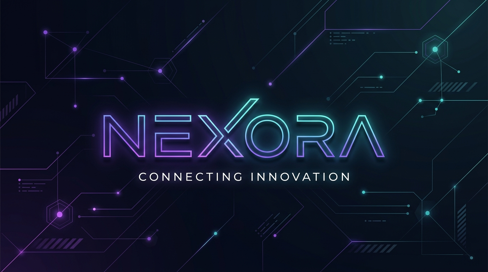
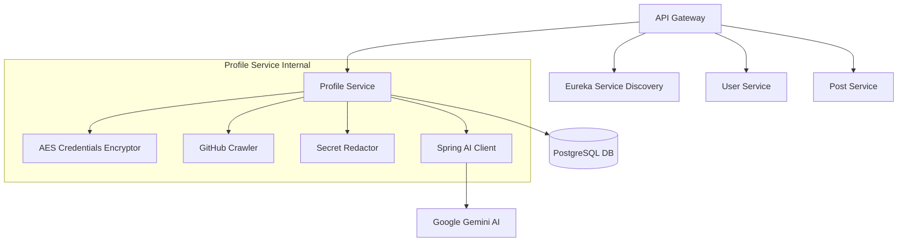

# Nexora — Engineering Evidence Analyzer

**Nexora** is a proof-of-work professional network where developers showcase verified engineering work instead of self-claimed skills. The platform bridges the gap between raw code repositories and resume summaries by automatically translating commit history, pull requests, and codebase structures into a recruiter-readable, evidence-backed technical profile. 

Built around the principle of **"evidence before assertion,"** Nexora provides recruiters and engineering leaders with a fast, trustworthy way to evaluate demonstrated technical capabilities, while giving developers a living, zero-maintenance portfolio that reflects their real-world contributions.

---

## 🎯 Core Value Proposition

### For Developers: The Zero-Maintenance Portfolio
*   **The Trajectory Dashboard:** Rather than a flat, green GitHub contribution grid that lacks context, Nexora parses daily commits and pushes to map growth and learning milestones in real time.
*   **Architectural Explainer:** Translates complex repository trees and code changes into clean, recruiter-readable system diagrams, dependency lists, and tradeoff analyses.
*   **Engineering Activity Feed (Upcoming):** LinkedIn feeds are saturated with low-signal self-promotion and text-based bragging. Nexora replaces "normal posts" with verified engineering updates. When you containerize a service or merge a critical security PR, Nexora automatically generates a structured activity post containing your system tradeoffs and code links, shifting the conversation from "talking about code" to "verifying shipped code."

### For Recruiters: Hiring with Instant Trust
*   **Bypassing the "Evaluation Tax":** Traditional technical screens are bogged down by buzzword stuffing (listing skills after a 10-minute tutorial). Nexora filters out the noise by requiring verified codebase proof for every claim.
*   **"Evidence Before Assertion":** Unlike opaque AI screening tools that output arbitrary candidate scores (e.g., *Python: 8/10*), Nexora creates a verifiable connections graph linking skill claims directly to inspectable file citations.
*   **Attribution & Authorship:** Evaluates pull requests and commit logs to distinguish a developer's specific contributions from inherited framework templates or team-authored codebases.

---

## 🔄 The Evidence Processing Pipeline

Nexora runs a stack-agnostic, security-first pipeline to extract and audit engineering credentials:

1.  **Information Gathering:** Fetches flat repository file trees, commit logs, and pull request history from GitHub webhooks.
2.  **Local Extraction Layer:** Calculates developer-specific contribution metrics, identifies CI/CD configurations, and extracts dependencies.
3.  **Secret Redaction Guardrail:** Redacts passwords, access tokens, JWT keys, database credentials, and certificates locally before any information is transmitted.
4.  **Normalized Dossier:** Compiles the sanitized codebase facts into a standardized, language-independent representation.
5.  **Spring AI Auditing:** Feeds the dossier into Google Gemini via Spring AI to derive system design summaries, architectural patterns, and capability claims.
6.  **Response Verification:** Validates the returned citations against the repository's actual file tree to prevent AI path hallucinations.
7.  **Evidence Graph Persistence:** Stores verified claims in a `PENDING` state in PostgreSQL, awaiting the developer's final approval before publishing.

---

## 🏗️ System Architecture

Nexora is designed as a distributed, high-throughput microservices backend powered by Spring Boot, Spring Cloud, Spring AI, and PostgreSQL:

*   **API Gateway:** Acts as the single entrypoint for all clients, handling request routing and cross-cutting security.
*   **User Service:** Manages developer registration, accounts, and JWT token authentication.
*   **Post Service:** Feeds user posts, peer engineering updates, and system architectural discussions.
*   **Profile Service:** Manages repository connections, schedules background sync tasks, scrubs configurations, and executes the Spring AI codebase auditor.
