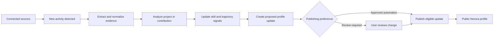

# Nexora AI-Verified Developer Profile

## Purpose

Nexora is a proof-of-work professional network where developers showcase verified engineering work instead of self-claimed skills. The product creates a living, evidence-backed technical profile from developer-owned sources and presents it through a project-first portfolio.

The core principle is **evidence before assertion**: Nexora may analyze and summarize evidence, but it must never present an opaque AI judgment as fact.

## Product Vision

A developer's Nexora profile should answer the questions recruiters and collaborators actually have:

- What has this person built?
- What was their contribution to each project?
- Which technologies have they demonstrably used?
- How deep is their experience in a given technical area?
- How is their work evolving over time?

Instead of the conventional profile order:

```text
Experience -> Education -> Skills
```

Nexora leads with:

```text
Projects -> Live demo -> Architecture -> GitHub -> Tech stack -> Evidence
```

## Target User

The initial product is for developers who want a credible portfolio and for recruiters, founders, and engineering leaders who need a fast, trustworthy way to evaluate demonstrated technical work.

Initial sources:

- GitHub
- Résumé upload
- Codeforces and LeetCode (optional supporting evidence)
- LinkedIn or other professional-profile imports where the user has authorized access
- User-provided project, deployment, and portfolio links

## Trust and Verification Model

Nexora must not use one ambiguous `AI Verified` badge. Profile claims need specific, explainable labels.

| Label | Meaning |
| --- | --- |
| Connected | The user linked a source to Nexora. |
| Ownership verified | Nexora confirmed that the user controls the connected account. |
| Evidence-backed | Specific source material supports a profile claim. |
| AI-analyzed | Nexora generated a summary or inference from disclosed evidence. |
| External verification | A company, institution, or credential issuer confirmed the claim. |

For every AI-generated claim, users and viewers should be able to open a **Why this appears** view. It should identify the supporting projects, repositories, commits, pull requests, résumé entries, activity, or user-provided context.

Example:

```text
PostgreSQL — high evidence confidence
Supported by: three featured projects, schema migrations, query code,
Docker configuration, and a résumé entry.
```

Confidence describes the quantity and quality of supporting evidence. It is not a universal score of talent or employability.

## Core Profile Experience

### Profile structure

```text
Identity and verification status
Featured projects
Technical profile
Strengths and areas with limited public evidence
Learning trajectory
Experience, education, and credentials
```

### Featured project

Each featured project should include:

- Problem statement and outcome
- Live demo, deployment, or product link
- GitHub repository link
- The developer's stated role and contribution
- Tech stack
- Architecture overview and key components
- AI-generated technical summary
- Important engineering decisions and tradeoffs
- Testing, CI/CD, security, observability, and documentation signals
- Evidence sources and confidence level

### Technical profile

Nexora synthesizes a structured technical profile from the user's approved sources:

- Languages, frameworks, databases, and infrastructure tooling
- Primary disciplines: backend, frontend, mobile, data, ML, DevOps, security
- Demonstrated depth for technologies and domains
- Project domains such as real-time collaboration, fintech, developer tooling, or e-commerce
- Recent work and current direction
- Engineering maturity signals

The profile should use measured, evidence-based language. For example:

> Strong backend evidence across several projects using Node.js, PostgreSQL, Redis, authentication flows, and Docker-based deployments. Public evidence of automated testing and observability is currently limited.

Avoid unsupported statements such as `Top 1% engineer`, `excellent developer`, or a single universal skill score.

## Evidence Inputs and Processing

### GitHub

GitHub is the primary MVP source. Relevant evidence can include:

- Repository metadata and README content
- Source-code structure and dependency files
- Commits, pull requests, issues, code reviews, and releases
- Tests, CI/CD workflows, deployment configuration, and documentation
- Contribution history and code ownership patterns

The user must choose repositories for analysis and control which ones are visible publicly. Private repository content must never be exposed by default.

### Résumé

The résumé provides declared experience, education, achievements, projects, and skills. Nexora should extract structured data, show the result to the user for correction, and use it as supporting—not conclusive—evidence.

### Competitive-programming profiles

Codeforces and LeetCode may provide evidence of problem-solving practice and consistency. They must remain an optional signal; competitive programming should not outweigh production-project evidence, collaboration, or engineering practices.

### LinkedIn and other professional imports

Professional-profile imports can help reconcile employment and education details where user authorization and platform access permit. Imported data should be labeled as connected or externally verified only when the actual source and verification level justify it.

## AI Analysis Outputs

The system should produce structured outputs that can be reviewed, edited, rejected, or regenerated.

### Project analysis

For every selected project, generate:

- Concise product and technical summary
- Architecture explanation
- Stack and dependency inventory
- Main technical decisions and tradeoffs found in documentation or code
- Evidence of tests, deployment, security, performance, monitoring, and documentation
- Contribution confidence, with limitations stated clearly
- Suggestions for making the project more credible to viewers

### Strengths and evidence gaps

Strengths must cite evidence. Areas for growth should be framed as missing or limited public evidence, never as a negative verdict.

Examples:

- `Demonstrated strength: backend API design, supported by eight substantial Node.js and Go repositories with database and authentication work.`
- `Limited public evidence: automated testing across reviewed repositories.`

### Role-fit views

Nexora can generate role-specific summaries, such as backend engineer, founding engineer, data engineer, mobile engineer, or DevOps engineer. Each view should show the evidence it selected and the capabilities where evidence is still limited.

## Learning Trajectory

The learning trajectory communicates a developer's direction and consistency. It is not a ranking system and should not penalize periods without public activity.

### Dimensions

| Dimension | Evidence examples |
| --- | --- |
| Technical depth | More complex architecture, performance work, system design, or ownership in a domain. |
| Breadth | Meaningful adoption of new languages, frameworks, or domains. |
| Application | Concepts learned and then applied to shipped work. |
| Shipping | Releases, deployed demos, merged work, and maintained projects. |
| Collaboration | Reviews, PR discussions, issue ownership, and team projects. |
| Consistency | Meaningful activity over time rather than a one-time burst. |
| Engineering maturity | Tests, CI/CD, documentation, observability, security, and maintenance. |
| Impact | Reliability, adoption, user outcomes, performance, or business outcomes where evidence exists. |

### Safe presentation language

Use statements such as:

- `Deepening backend-systems experience.`
- `Expanding into cloud deployment and infrastructure.`
- `Applying data-structures practice in project work.`
- `Recent public activity emphasizes real-time application development.`
- `No recent public evidence available.`

Never label a developer as stagnant, declining, weak, or unhireable based on inactivity or incomplete source data.

## Living Profile Update Pipeline

Every new source event should create evidence first, then a proposed profile update.



Examples of proposed updates:

- `Added Docker deployment evidence to Project X.`
- `Raised PostgreSQL evidence confidence from Medium to High.`
- `Detected recurring work with background jobs and queue processing.`
- `A new project is ready for review.`

The default is user review before a public change. Users may opt into automatic publication only for low-risk update categories.

## Recommended Data Model

Store source evidence separately from AI conclusions so Nexora can reproduce, correct, and regenerate analyses.

```text
User
  ├── ConnectedSource
  │     ├── provider
  │     ├── ownership status
  │     └── consent and visibility settings
  ├── SourceEvent
  │     ├── provider event ID
  │     ├── captured payload/reference
  │     └── event timestamp
  ├── EvidenceItem
  │     ├── source reference
  │     ├── extracted fact or signal
  │     ├── visibility
  │     └── confidence
  ├── Project
  │     ├── declared metadata
  │     ├── linked evidence
  │     └── analysis versions
  ├── DerivedClaim
  │     ├── claim type
  │     ├── supporting evidence
  │     ├── explanation
  │     ├── confidence
  │     └── user approval state
  ├── TrajectorySnapshot
  └── ProfileChange
```

Key requirements:

- Preserve source references and timestamps.
- Version AI analyses and profile changes.
- Let users correct, hide, reject, or attach context to derived claims.
- Recompute conclusions when source data changes or analysis models improve.
- Keep private-source data and public-profile data strictly separated.

## Privacy, Safety, and Fairness Requirements

- Users choose which sources, repositories, evidence, and generated insights are public.
- Do not publish private repository content or inferred sensitive data by default.
- Clearly distinguish user claims, source facts, and AI inferences.
- Provide correction, dispute, and deletion flows for every AI-generated conclusion.
- Do not infer personality, protected characteristics, health, political views, or other sensitive attributes.
- Do not make final hiring recommendations from a composite AI score.
- Avoid penalizing users for lack of public activity, access to premium platforms, career breaks, or nontraditional backgrounds.
- Apply retention, deletion, consent, and audit controls to connected-source data.

## Delivery Roadmap

### Phase 1: Credible project-first MVP

- User profile creation
- GitHub connection and ownership verification
- Résumé upload and editable extraction
- User-selected repository analysis
- Project pages with repository, stack, architecture summary, and evidence
- User-reviewed AI technical profile
- Shareable public profile

### Phase 2: Living technical profile

- GitHub webhooks or scheduled updates
- Evidence graph and claim explanations
- Technical-profile confidence levels
- Profile change history
- Learning-trajectory snapshots
- User preferences for review versus low-risk automatic updates

### Phase 3: More sources and stronger proof

- Codeforces and LeetCode imports
- Live-demo and deployment link validation
- Open-source contribution analysis
- Project-specific peer recommendations
- Credential and education verification
- Authorized professional-profile imports

### Phase 4: Hiring product

- Recruiter proof mode
- Search by demonstrated capabilities and project domains
- Evidence-backed role-fit views
- Candidate shortlisting based on explicit job criteria
- Organization, employer, and credential verification integrations

## MVP Acceptance Criteria

The first release is successful when a developer can:

1. Create an account and connect GitHub.
2. Upload a résumé and correct extracted information.
3. Select up to three repositories as featured projects.
4. Review an AI-generated project summary, stack, and evidence list.
5. Approve or edit a technical profile summary.
6. Publish a shareable project-first profile.
7. See where each generated claim came from.
8. Control the visibility of every connected source and featured project.

## Success Metrics

Measure trust and usefulness, not only activity:

- GitHub connection rate
- Profile-completion and public-profile publish rate
- Featured-project selection rate
- AI suggestion acceptance, editing, and rejection rates
- Percentage of claims with inspectable evidence
- Recruiter profile-view to contact conversion
- Developer return rate after source updates
- Number and resolution time of disputed inferences
- User-reported interview or hiring outcomes, where voluntarily shared

## Immediate Build Priority

Build the narrowest differentiated experience first:

```text
GitHub connection
  -> user-selected repositories
  -> AI project analysis
  -> user-approved evidence-backed technical summary
  -> public project-first profile
```

This establishes Nexora's core value: a developer can show verifiable work, and a viewer can understand why the profile makes each technical claim.
